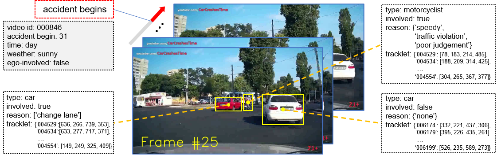

# :oncoming_automobile: CarCrashDataset
This repo contains our car crash dataset (CCD) for traffic accident anticipation.

## Contents
0. [Overview](#overview)
0. [Download](#download)
0. [Description](#description)
0. [Citation](#citation)

<a name="overview"></a>
## :globe_with_meridians:  Overview 
<div align=center>
  
</div>

Car Crash Dataset (CCD) is collected for traffic accident analysis. It contains real traffic accident videos captured by dashcam mounted on driving vehicles, which is critical to developing safety-guaranteed self-driving systems. CCD is distinguished from existing datasets for diversified accident annotations, including environmental attributes (day/night, snowy/rainy/good weather conditions), whether ego-vehicles involved, accident participants, and accident reason descriptions. An overview of our accident annotations is dipicted in the figure above.

<a name="download"></a>
## :file_cabinet:  Download 

Download CCD from [Google Drive](https://drive.google.com/drive/folders/1NUwC-bkka0-iPqhEhIgsXWtj0DA2MR-F?usp=sharing).

<a name="description"></a>
## :card_index_dividers:  Description

### File structure of the dataset

Please make sure your downloaded files are structured as following:
```
CarCrash
├── codes                    # useful codes for analyzing the dataset
├── vgg16_features
│   ├── positive             # feature files of possitive (accident) videos
│   │   ├── 000001.npz
│   │   ├── ...
│   │   └── 001500.npz
│   ├── negative             # feature files of negative (normal) videos
│   │   ├── 000001.npz
│   │   ├── ...
│   │   └── 003000.npz
│   ├── train.txt            # list file of training split 
│   └── test.txt             # list file of testing split 
├── videos
│   ├── Normal               # normal driving videos
│   │   ├── 000001.mp4
│   │   ├── ...
│   │   └── 003000.mp4
│   ├── Crash-1500           # crash accident videos
│   │   ├── 000001.mp4
│   │   ├── ...
│   │   └── 001500.mp4
│   └── Crash-1500.txt       # annotation file for crash accident
└── README.md
```

### Videos and Features

**Videos**: We collected traffic accident videos from YouTube channels and split them to get 1,500 trimmed videos. Each video contains 50 frames with 10 frames per second. The 3,000 normal videos are randomly sampled from [BDD100K dataset](https://bdd-data.berkeley.edu/index.html).

**Features**: Feature files in folders `vgg16_features/` are extracted VGG-16 features of all frames and all detected bounding boxes. **All of bounding boxes are saved in these files**. We use the public detection codebase [MMDetection](https://github.com/open-mmlab/mmdetection) to train [Cascade R-CNN](http://openaccess.thecvf.com/content_cvpr_2018/papers/Cai_Cascade_R-CNN_Delving_CVPR_2018_paper.pdf) with [ResNeXt-101](http://openaccess.thecvf.com/content_cvpr_2017/papers/Xie_Aggregated_Residual_Transformations_CVPR_2017_paper.pdf) backbone and [FPN](http://openaccess.thecvf.com/content_cvpr_2017/papers/Lin_Feature_Pyramid_Networks_CVPR_2017_paper.pdf) neck as our object detector on [KITTI 2D detection dataset](http://www.cvlibs.net/datasets/kitti/eval_object.php?obj_benchmark=2d). We use Cascade R-CNN to obtain top-19 bounding boxes and then they are used for feature extraction with pre-trained ImageNet VGG-16 model. For each feature file (i.e., `000001.npz`), the following data are provided:
> * **data**: Extracted 4096-dim features with shape (50, 20, 4096). It contains frame-level feature with shape (50, 1, 4096) and 19 box-level features with shape (50, 19, 4096).
> * **det**: Detected bounding boxes with shape (50, 19, 6), where the last dim denotes (x1, y1, x2, y2, prob, cls). 
> * **labels**: One-hot video labels to indicate whether the video contains an accident, i.e., `[0, 1]` denotes positive (accident) and `[1, 0]` denotes negative (normal).
> * **ID**: The video name for current feature file.


### Annotation Format

The annotations of 1,500 accident videos are saved in the file `CarCrash/videos/Crash-1500.txt`. For each line, the followings are provided:

 > * **vidname**: Video name of each accident video, i.e., `000001`
 > * **binlabels**: Binary labels of all 50 frames for each video. Label `1` indicates accident frame.
 > * **startframe**: The zero-padded starting frame of each video in original untrimmed YouTube video.
 > * **youtubeID**: The numeric ID of original YouTube video identifier.
 > * **timing**: Timing conditions, i.e., `Day` and `Night`.
 > * **weather**: Weather conditions, i.e., `Normal`, `Snowy`, and `Rainy`.
 > * **egoinvolve**: Boolean identifier to indicate wheather the ego-vehicle is involved in the accident of this video.

 **Note**: Current version of CCD only provides the temporal annotations and environmental attributes listed above. For more detailed annotations such as traffic accident reasons and tracklets, we will release them soon.


 <a name="citation"></a>
## :bookmark_tabs:  Citation

Please cite our paper if you find our dataset useful.

```
@InProceedings{BaoMM2020,
    author = {Bao, Wentao and Yu, Qi and Kong, Yu},
    title  = {Uncertainty-based Traffic Accident Anticipation with Spatio-Temporal Relational Learning},
    booktitle = {ACM Multimedia Conference},
    month  = {May},
    year   = {2020}
}
```

We thank [Haiting Hao](https://github.com/haohaiting) a lot for data collection. If you have any questions about the dataset, please feel free to contact [Wentao Bao](mailto:wb6219@rit.edu).
